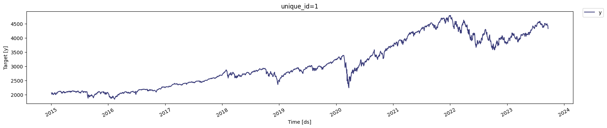
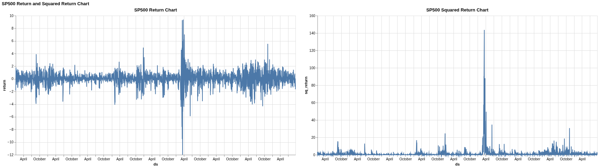
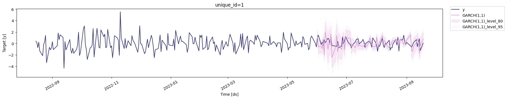

# Modeling S&P 500 Using GARCH

In financial markets, predicting the direction of a stock price is incredibly difficult. However, predicting its **volatility**—how much the price is likely to fluctuate—is often more achievable and just as important for managing risk. This project will walk you through an end-to-end workflow for modeling the volatility of the S&P 500 index using a **GARCH (Generalized Autoregressive Conditional Heteroskedasticity)** model.


### **1. Data Acquisition and Preparation**

Our first step is to acquire historical data for the S\&P 500 index (`^GSPC`) using the `yfinance` library. We'll focus on the daily 'Close' price from early 2015 to late 2023.

```python
ticker = '^GSPC'
period1 = dt.datetime(2015, 1, 1)
period2 = dt.datetime(2023, 9, 22)
interval = '1d' # 1d, 1m

SP_500 = yf.download(ticker, start=period1, end=period2, interval=interval, progress=False)
SP_500 = SP_500.reset_index()

df=SP_500[["Date","Close"]]
df["unique_id"]="1"
df.columns=["ds", "y", "unique_id"]
StatsForecast.plot(df)
```

<figure markdown="span">
    { width="600" }
  <figcaption>S&P 500 Time Series Data Visualized</figcaption>
</figure>

The `statsforecast` library requires the data to be in a specific format with columns named `ds` (for the date), `y` (for the value we're analyzing), and `unique_id` (to identify the time series). We rename our columns accordingly to prepare for modeling.

-----

### **2. Analyzing the Raw Price Series**

Before we can model volatility, we need to understand the characteristics of our data. Most statistical models, including those for volatility, assume the data is **stationary**.  We can use the **Augmented Dickey-Fuller (ADF) test** to check for stationarity. 


```python

def Augmented_Dickey_Fuller_Test_func(series , column_name):
    print (f'Dickey-Fuller test results for columns: {column_name}')
    dftest = adfuller(series, autolag='AIC')
    dfoutput = pd.Series(dftest[0:4], index=['Test Statistic','p-value','No Lags Used','Number of observations used'])
    for key,value in dftest[4].items():
       dfoutput['Critical Value (%s)'%key] = value
    print (dfoutput)
    if dftest[1] <= 0.05:
        print("Conclusion:====>")
        print("Reject the null hypothesis")
        print("The data is stationary")
    else:
        print("Conclusion:====>")
        print("The null hypothesis cannot be rejected")
        print("The data is not stationary")
     

Augmented_Dickey_Fuller_Test_func(df["y"],'S&P500')
```

**Interpreting the ADF Test Results**

When we run the ADF test on the raw S\&P 500 closing prices, the **p-value** will be significantly greater than 0.05. This means we cannot reject the null hypothesis, leading to the conclusion that the raw price data is **not stationary**. It has a clear trend, making it unsuitable for direct modeling.


### **3. Transforming Data to Returns**

To address the non-stationarity, we'll transform the price series into a series of daily **returns**. Returns are stationary and represent the percentage change in price from one day to the next.

```python
df['return'] = 100 * df["y"].pct_change()
df.dropna(inplace=True, how='any')
df['sq_return'] = df["return"].mul(df["return"])

# visualizing the time series

base = alt.Chart(df).mark_line().encode(
    x='ds',
    # y='return',
).properties(
    width=800,
    height=400,
    # title="SP500 Return Chart"
)
return_chart = base.encode(
    y='return'
).properties(
    title="SP500 Return Chart"
)
sq_return_chart = base.encode(
    y='sq_return'
).properties(
    title="SP500 Squared Return Chart"
)

(return_chart | sq_return_chart).properties(
    title="SP500 Return and Squared Return Chart"
)

```

<figure markdown="span">
    { width="600" }
  <figcaption>S&P 500 Returns vs. Squared Returns</figcaption>
</figure>

We also calculate the **squared returns**, as this is often used as a proxy for financial variance or volatility. The visualization of the returns and squared returns reveals a key characteristic of financial data known as **volatility clustering**. Notice how periods of high fluctuation are clumped together, followed by periods of relative calm. This is precisely the phenomenon that GARCH models are designed to capture.


### **4. Checking for Autocorrelation**

Next, we use the **Ljung-Box test** to check if there is significant autocorrelation in our returns data. Autocorrelation means that past values are correlated with future values.

```python
ljung_res = acorr_ljungbox(df["return"], lags= 40, boxpierce=True)

# ln_pvalue < 0.05 ? reject null hypotheses i.e. no autocorrelation
ljung_res.head()
     

df=df[["ds","unique_id","return"]]
df.columns=["ds", "unique_id", "y"]
train = df[df.ds<='2023-05-31'] # Let's forecast the last 30 days
test = df[df.ds>'2023-05-31']
train.shape, test.shape
```

**Interpreting the Ljung-Box Test Results**

The test results will show very small p-values <0.05 for our returns data. This leads us to **reject the null hypothesis** of no autocorrelation, confirming that the returns are indeed correlated with their past values. This is another signal that a time-dependent model like GARCH is appropriate.

-----

### **5. Model Selection with Cross-Validation**

A GARCH model is defined by two parameters, `p` and `q`, which represent the number of past squared returns and past variances to include in the model, respectively. To find the best combination of `(p,q)`, we use **cross-validation**.

`StatsForecast`'s `cross_validation` function automates this process by creating multiple "windows" of training data and testing how well different GARCH models perform at forecasting. We evaluate the models using the **Root Mean Squared Error (RMSE)**, with the goal of finding the model order that produces the lowest average error.

```python
season_length = 7 # Dayly data
horizon = len(test) # number of predictions biasadj=True, include_drift=True,

models = [GARCH(1,1),
          GARCH(1,2),
          GARCH(2,2),
          GARCH(2,1),
          GARCH(3,1),
          GARCH(3,2),
          GARCH(3,3),
          GARCH(1,3),
          GARCH(2,3)]

sf = StatsForecast(
    models=models,
    freq='C', # custom business day frequency
)

crossvalidation_df = sf.cross_validation(df=train,
                                         h=horizon,
                                         step_size=6,
                                         n_windows=5)

print(crossvalidation_df)
     

evals = evaluate(crossvalidation_df.drop(columns='cutoff'), metrics=[rmse], agg_fn='mean')
print(evals)
```

Based on the cross-validation results, the `GARCH(1,1)` model is often a strong performer for financial data, so we'll select that for our final model.

-----

### **6. Fitting and Forecasting**

Now, we fit our chosen `GARCH(1,1)` model to the training dataset and use it to forecast volatility for the hold-out test period.

```python
season_length = 7 
horizon = len(test) 
models = [GARCH(1,1)]

sf = StatsForecast(models=models,
                   freq='C', 
                  )
sf.fit(df=train)

StatsForecast(models=[GARCH(1,1)], freq='C')

result=sf.fitted_[0,0].model_
display(result)

residual=pd.DataFrame(result.get("actual_residuals"), columns=["residual Model"])
display(residual)
     

Y_hat = sf.forecast(df=train, h=horizon, fitted=True, level=[95])
display(Y_hat.head())
values=sf.forecast_fitted_values()
display(values.head())
sf.plot(train, Y_hat.merge(test), max_insample_length=200)
     

forecast_df = sf.predict(h=horizon, level=[80,95])
sf.plot(train, test.merge(forecast_df), level=[80, 95], max_insample_length=200)
    
```

<figure markdown="span">
    { width="600" }
  <figcaption>Predicted Returns and the Intervals</figcaption>
</figure>

The plots generated by `StatsForecast` allow us to visually inspect how well our model's predictions align with the actual returns in the test set. The shaded regions represent the 80% and 95% **prediction intervals**, giving us a probabilistic range for our forecasts.

-----

### **7. Final Model Evaluation**

Finally, we quantitatively evaluate the model's performance on the test set using a variety of metrics.

```python
evaluate(
    test.merge(Y_hat),
    metrics=[mae, mape, partial(mase, seasonality=season_length), rmse, smape],
    train_df=train,
)
```

Metrics like **Mean Absolute Error (MAE)** and **Root Mean Squared Error (RMSE)** tell us the average magnitude of our forecast errors in the same units as the original data (daily returns). The **Mean Absolute Percentage Error (MAPE)** gives us a sense of the error in percentage terms, which is often easier to interpret. This final evaluation gives us a concrete measure of how well our GARCH model can predict the volatility of the S&P 500.
