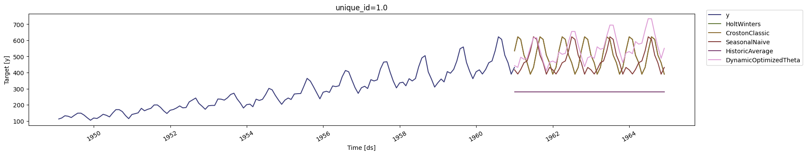
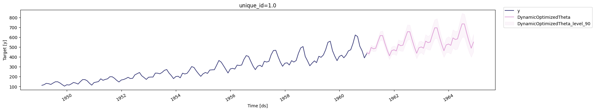

# **Modeling Workflow in Action**

In this demonstration, we'll explore how to automate the process of finding a good forecasting model and how to empirically compare different types of models to select the best one for our data. We'll be using the `StatsForecast` library, which is designed for high-performance time series forecasting.

-----

## **1. Automated ARIMA Modeling**

Previously, you learned how to manually select the parameters for an ARIMA model by interpreting ACF and PACF plots. While this is a valuable skill, it can be time-consuming and subjective. The `AutoARIMA` model automates this process.

**Conceptually**, `AutoARIMA` intelligently searches through numerous combinations of ARIMA parameters `(p,d,q)(P,D,Q)` and selects the model that best fits the data according to a statistical criterion (like AIC). This saves you time and provides a reproducible, data-driven starting point.

**At the implementation level**, we instantiate `StatsForecast` with an `AutoARIMA` model. We must provide the `season_length`, which is 12 for the monthly Air Passengers data, so the model knows to look for yearly patterns. We then fit the model and generate a 12-month forecast.

```python
df = AirPassengersDF
sf = StatsForecast(
    models=[AutoARIMA(season_length = 12)],
    freq='MS',
)
sf.fit(df)
forecast_df = sf.predict(h=12, level=[90])
forecast_df.tail()
```

-----

## **2. Comparing Multiple Forecasting Models**

No single forecasting model is the best for every situation. Different models have different underlying assumptions and excel at capturing different types of patterns. Therefore, a common and effective strategy is to run a "horse race" between several models and see which one performs best on your specific data.

**Conceptually**, we are testing a diverse set of models. For example:

  * **`HoltWinters`**: A classic model that explicitly captures trend and seasonality.
  * **`SeasonalNaive`**: A simple but powerful baseline model that predicts the value will be the same as it was in the last season (e.g., this July's value will be the same as last July's).
  * **`HistoricAverage`**: A very simple model that predicts the average of all past observations.
  * **`DOT (DynamicOptimizedTheta)`**: A powerful forecasting method based on the Theta decomposition principle. 

By comparing these against each other, we can get a much better sense of which approach works best.

**At the implementation level**, we create a list of different model instances and pass them to the `StatsForecast` class. The library will then fit each of these models to our data simultaneously.

```python
# Create a list of models and instantiation parameters
models = [
    HoltWinters(),
    Croston(),
    SeasonalNaive(season_length=12),
    HistoricAverage(),
    DOT(season_length=12)
]

# Instantiate StatsForecast class as sf
sf = StatsForecast( 
    models=models,
    freq='MS', 
    n_jobs=-1,
    fallback_model=SeasonalNaive(season_length=7),
    verbose=True,
)

# Fit & Predict
forecasts_df = sf.forecast(df=df, h=48, level=[90])
forecasts_df.head()
```

We can then use the built-in `plot` function to visually inspect the forecasts generated by all the models against the historical data.

-----

## **3. Rigorous Model Selection with Cross-Validation**

Visual inspection is useful, but for a robust and unbiased comparison, we need to use **backtesting**, also known as time series **cross-validation**.

**Conceptually**, cross-validation simulates how our models would have performed in the past. It works by creating several "windows" of data. For each window, it trains the models on an initial part of the data and tests their performance on a subsequent part. By averaging the performance across these windows, we get a reliable estimate of each model's true predictive accuracy.

**At the implementation level**, we use the `cross_validation` method. We specify `h=12` to test the models' ability to forecast 12 months ahead. The `n_windows=2` parameter tells the function to create two separate training and testing periods.

```python
cv_df = sf.cross_validation(
    df=df,
    h=12,
    step_size=12,
    n_windows=2
)
cv_df.head()
```

-----

<figure markdown="span">
    { width="600" }
  <figcaption>Prediction Performace by Various Models</figcaption>
</figure>

<figure markdown="span">
    { width="600" }
  <figcaption>Prediction Performace by the Best Model</figcaption>
</figure>
## **4. Evaluating the Results**

The final step is to calculate a performance metric, like the **Mean Squared Error (MSE)**, for each model on the cross-validation results. The model with the lowest average error is considered the best for this dataset.

**Conceptually**, we are summarizing the performance from our backtesting experiment into a single number for each model, allowing for a direct and objective comparison.

**At the implementation level**, we create a simple helper function to calculate the MSE for each model and identify the one with the minimum error.

```python
def evaluate_cv(df, metric):
    models = df.columns.drop(['unique_id', 'ds', 'y', 'cutoff']).tolist()
    evals = metric(df, models=models)
    evals['best_model'] = evals[models].idxmin(axis=1)
    return evals

evaluation_df = evaluate_cv(cv_df, mse)
display(evaluation_df.head())
```

Finally, we can count the number of times each model was selected as the "best model" across the different cross-validation windows. This gives us strong, empirical evidence to support our choice of which model to deploy for future forecasting.

```python
evaluation_df['best_model'].value_counts()
```