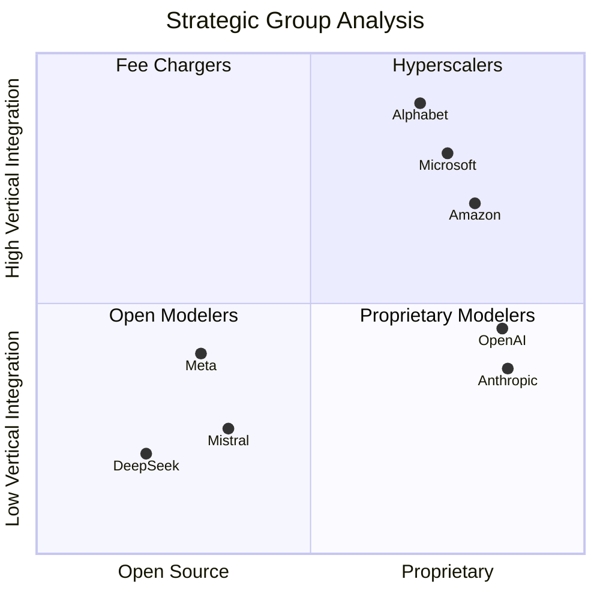

## Quadrant Chart

```mermaid
quadrantChart
    title Strategic Group Analysis
    x-axis Open Source --> Proprietary
    y-axis Low Vertical Integration --> High Vertical Integration
    quadrant-1 Hyperscalers
    quadrant-2 Fee Chargers
    quadrant-3 Open Modelers
    quadrant-4 Proprietary Modelers
    Meta: [0.3, 0.4]
    OpenAI: [0.85, 0.45]
    Alphabet: [0.70, 0.90]
    Microsoft: [0.75, 0.80]
    Amazon: [0.80, 0.7]
    Anthropic: [0.86, 0.37]
    DeepSeek: [0.20, 0.20]
    Mistral: [0.35, 0.25]
```