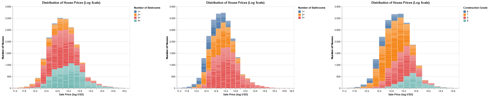
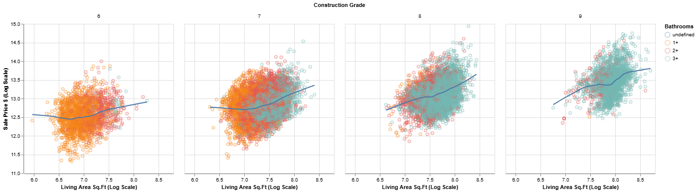
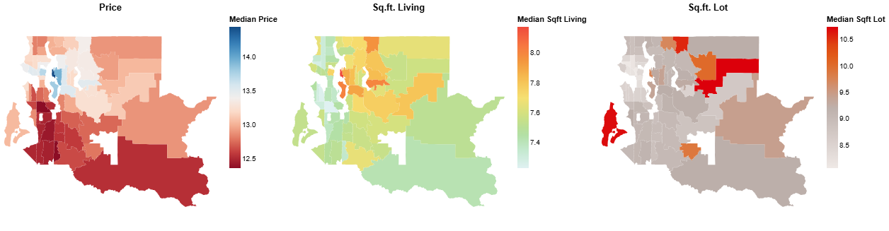
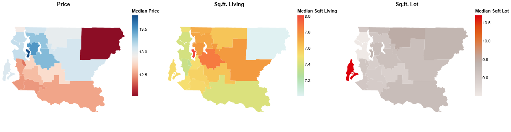
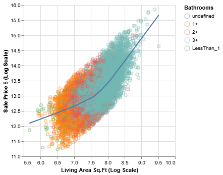
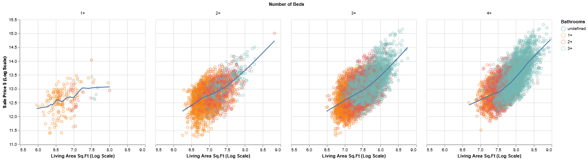

# Building the Narrative - Horizontal Development

Before we dive into arranging multiple visuals into a cohesive story, let's take a moment for a quick checkpoint. You've come a long way, and it's good to ensure your "virtual workspace" is organized and you're ready for this next stage of narrative construction.

## **Checkpoint: Am I Ready to Build the Narrative?** 📍

You've journeyed through understanding your data, defining analytical goals, making initial visualization plans, encountering the "reality checks" of data issues, and then iteratively cleaning your data and refining individual visualizations. This is a significant amount of work!

**What Your "Virtual Workspace" Might Look Like Now:**

By this point, you should ideally have:

1.  **Cleaned(er) Data:** A version of your Polars DataFrame (`housing_df`) that reflects the cleaning and transformation tasks you deemed necessary in Step 6 and executed in Step 7 (e.g., parsed dates, transformed variables like `price_log`, newly engineered features like `price_per_sqft`).
2.  **Refined Individual Visualizations:** Python scripts or notebook cells with Altair code for several *individually developed and refined* charts. These are the "panels" you've been working on, likely improved through the iterative cycle of Step 7.
3.  **Updated Task Lists:**
    * Your **Data Cleaning Task List** should show completed tasks.
    * Your **Data Visualization Task List** is likely at V2 or V3, reflecting the refinements made to your initial ideas, and perhaps even some new visual ideas sparked during exploration.
4.  **Clear Analytical Questions:** Your guiding analytical questions (from Step 2) for your persona should still be front-of-mind, as these are what your story aims to answer.

**Self-Assessment - "Am I Doing Okay?"**

Ask yourself:

* "Do I have 2-4 refined visualizations whose code I understand and that I believe are now reasonably effective at showing a specific aspect of the data (e.g., a distribution, a relationship, a comparison)?"
* "Does the data feeding these visuals now seem appropriate for their purpose, thanks to the cleaning I've done?"
* "Can I look at my refined individual charts and clearly articulate which analytical question (from Step 2) each one helps to answer?"
* "Do I feel the 'Uh-Oh' moments from Step 5 have been largely addressed for these key visuals?"

If you can answer "yes" or "mostly yes" to these, you're in great shape to start thinking about how to weave these visuals together into a story. If some areas still feel a bit shaky, that's okay too! This workflow is iterative. You can always revisit earlier steps. For now, proceed with the understanding that your current set of refined visuals will be the building blocks for your narrative.

This checkpoint serves to ensure you're building your story on a solid foundation of well-understood, individually refined components. Now, let's explore how to arrange these into a compelling sequence.


## Step 8: Creating a Cohesive Set of Visuals (The "Comic Strip") 🖼️➡️🖼️➡️🖼️

**Horizontal visual development** is about thoughtfully selecting and sequencing multiple visualizations to guide your audience through your findings, building understanding layer by layer, much like a comic strip tells a story panel by panel.

**Key Principles of Horizontal Development:**

1.  **Logical Flow:** The sequence of visuals should follow a logical progression. This might mean:
    * **Overview first, then details:** Start with a high-level summary (e.g., overall distribution of prices) and then drill down into specifics (e.g., price drivers, comparisons).
    * **Problem/Question, then evidence/answer:** Pose a question implicitly or explicitly with one visual, then use subsequent visuals to explore and answer it.
    * **Building complexity:** Start with simpler relationships and introduce more variables or facets gradually.
2.  **Complementary Information:** Each visual in the sequence should add a new piece of information or a different perspective, building upon the previous ones. Avoid redundancy unless it's for intentional emphasis.
3.  **Clear Transitions:** While we'll discuss narrative text later (Step 9), the visual transition itself should feel natural. The audience should understand why they are seeing the next chart in the sequence.
4.  **Audience Focus (Revisit Your Persona!):** The chosen sequence should directly address the key questions and goals of your audience persona (from Step 2). What order of information would make the most sense *to them*?
5.  **Consistent Aesthetics (Where Appropriate):** Using consistent color palettes for the same categories across different charts, similar font styles, and a generally unified design language can make the "story" feel more professional and easier to follow. However, variations can be used intentionally to highlight changes in focus.

**Example: Building a Mini-Story for "Sarah the Savvy Homebuyer"**

Let's imagine Sarah wants to understand the King County housing market, focusing on price, size, and location. Here's a possible sequence of 2-3 visuals (using concepts from our cleaned data):

**Visual 1: Overall Price Landscape**

* **Chart Type:** Histogram of `price_log` (log-transformed prices).
* **Purpose:** Give Sarah an understanding of the general distribution of house prices – what's typical, the range, and the shape of the market.
* **Key Insight:** Most houses fall within a certain price band, but there's a long tail of more expensive properties.

    ```python
    # Incomplete code listing.
    # skips several data cleaning /tranformation steps.
    price_histogram = alt.Chart(housing_cleaned_df).mark_bar().encode(
        x=alt.X('price_log:Q').bin(maxbins=30).title('Sale Price (log USD)'),
        y=alt.Y('count()').title('Number of Houses'),
        tooltip=[
            alt.Tooltip('price', title="Price USD"),
            alt.Tooltip('count()', title='Number of Houses'), ]
    ).properties(
        title='Distribution of House Prices (Log Scale)',
        width=500,
        height=350
    )

    bed_colored = price_histogram.encode(
        color=alt.Color('bed_cat:N', title='Number of Bedrooms')
    ).transform_filter(
    alt.FieldOneOfPredicate(field='bed_cat', oneOf="1+ 2+ 3+ 4+".split())
    )

    bath_colored = price_histogram.encode(
        color=alt.Color('bath_cat:N', title='Number of Bathrooms')
    ).transform_filter(
    alt.FieldOneOfPredicate(field='bath_cat', oneOf="1+ 2+ 3+".split())
    )

    grade_colored = price_histogram.encode(
        color=alt.Color('grade_cat:N', title='Construction Grade')
        ).transform_filter(
    alt.FieldOneOfPredicate(field='grade_cat', oneOf="6 7 8 9".split())
    )

    ```
<figure markdown="span">
    
  <figcaption>Price Distribution: Using Colors and Facets to Communicate More Context</figcaption>
</figure>

**Visual 2: Price vs. Key Feature (Living Area)**

* **Chart Type:** Scatter plot of `price_log` vs. `sqft_living`, perhaps with `grade` encoded by color.
* **Purpose:** Show Sarah how a primary feature (living area) relates to price, and if construction grade plays a role.
* **Key Insight:** Generally, as living area increases, price increases. Higher grade houses tend to command higher prices for similar sizes.

    ```python
    # Incomplete code listing.
    # skips several data cleaning /tranformation steps.
    points = alt.Chart(housing_cleaned_df).mark_point(opacity=0.4).encode(
        x=alt.X('sqft_living_log', title='Living Area Sq.Ft (Log Scale)', scale=alt.Scale(zero=False)),
        y=alt.Y('price_log', title='Sale Price $ (Log Scale)', scale=alt.Scale(zero=False)),
        tooltip=[
            alt.Tooltip('price:Q', title='Price', format='$,.0f'),
            alt.Tooltip('sqft_living:Q', title='SqFt Living'),
            alt.Tooltip('bedrooms:Q', title='Bedrooms'),
            alt.Tooltip('bathrooms:Q', title='Bathrooms'),
            alt.Tooltip('grade:O', title='Grade')
        ]
    )

    line = points.transform_loess(
            "sqft_living_log",
            "price_log").mark_line( color='red')

    price_size = (points + line).encode(
        color=alt.Color('bath_cat:N', title='Bathrooms'),
            )
    price_size.facet(
    alt.Facet("grade_cat:N", title="Construction Grade")
    ).transform_filter(
        alt.FieldOneOfPredicate(field='bed_cat', oneOf="1+ 2+ 3+ 4+".split()),
        alt.FieldOneOfPredicate(field='bath_cat', oneOf="1+ 2+ 3+".split()),
        alt.FieldOneOfPredicate(field='grade_cat', oneOf="6 7 8 9".split())
    )
    ```
<figure markdown="span">
  <figcaption>Price vs Size Faceted by Construction Grade</figcaption>
</figure>


**Visual 3: Price Variation by Location (Zip Code)**

* **Chart Type:** Bar chart (or box plot) showing the distribution of `price_log` (or median `price`) for several key `zipcode`s. Alternatively, a choropleth map if geo-data for zip codes is available and joined.
* **Purpose:** Help Sarah understand how prices vary geographically.
* **Key Insight:** There are noticeable price differences across zip codes, with some areas being significantly more expensive than others.

    ```python
    # Incomplete code listing.
    # skips several data cleaning /tranformation steps.
    # uses GeoPandas DataFrame
    base = alt.Chart(kczip_cleaned).mark_geoshape(
    # filled=False,
    strokeWidth=1.5
    )

    price = base.encode(
        alt.Color('price_log:Q').scale(scheme="redblue").legend(title="Median Price"),
        tooltip=[
            alt.Tooltip('price', title='Median Price'),
            alt.Tooltip('zipcode', title='Zipcode')
        ]
    ).properties(title="Price",)

    sqft_liv = base.encode(
        alt.Color('sqft_living_log:Q').scale(scheme="lightmulti").legend(title="Median Sqft Living"),
        tooltip=[
            alt.Tooltip('sqft_living', title='Median Sqft Living'),
            alt.Tooltip('zipcode', title='Zipcode')
        ]
    ).properties(title="Sq.ft. Living",)

    sqft_lot = base.encode(
        alt.Color('sqft_lot_log:Q').scale(scheme="lightgreyred").legend(title="Median Sqft Lot"),
        tooltip=[
            alt.Tooltip('sqft_lot', title='Median Sqft Lot'),
            alt.Tooltip('zipcode', title='Zipcode')
        ]
    ).properties(title="Sq.ft. Lot",)

    (price | sqft_liv | sqft_lot).resolve_scale(
        color='independent'
    )
    ```

<figure markdown="span">
  
  <figcaption>Price, Size, and Lot across King County Zip Codes</figcaption>
</figure>


<figure markdown="span">
  
  <figcaption>Price, Size, and Lot across King County School Districts</figcaption>
</figure>


This sequence tells a story: "Here's the overall market (Visual 1), here's how a key feature like size influences price (Visual 2), and here's how location further impacts it (Visual 3)."

??? tip "**Arranging Charts with Altair: Concatenation Operators**"

    Altair makes it easy to combine multiple charts into a single visualization object using intuitive operators:

    * `chart1 | chart2`: **Horizontal Concatenation (hconcat)**. Places `chart2` to the right of `chart1`. Perfect for a "comic strip" sequence.
    * `chart1 & chart2`: **Vertical Concatenation (vconcat)**. Places `chart2` below `chart1`. Useful for stacking related views.
    * `chart1 + chart2`: **Layering**. Places `chart2` on top of `chart1`. Both charts must share the same x and y scales. This is primarily for "vertical development" within a single conceptual chart (e.g., adding a regression line to a scatter plot), which we touched upon in Step 7, but it's part of the same family of operators.

    These operators allow you to build complex, multi-view displays from simpler components.

**Slicing, Dicing, and Faceting for Richer Narratives:**

Part of horizontal development can also involve showing different "slices" or "facets" of your data to provide deeper insights or comparisons.

* **Filtering:** You might show a general trend, then show the same chart filtered for a specific subgroup (e.g., "Here's `price` vs. `sqft_living` for all houses, and now here it is just for `waterfront` properties").
* **Faceting (Small Multiples):** Instead of multiple separate charts, you can use faceting (e.g., `facet` or `row`/`column` encodings in Altair) to create a grid of charts that show the same relationship broken down by different categories. For example, you could facet the `price` vs. `sqft_living` scatter plot by `bedrooms`. This allows for easy comparison across categories.

    ```python
    points = alt.Chart(housing_cleaned_df).mark_point(opacity=0.4).encode(
        x=alt.X('sqft_living_log', title='Living Area Sq.Ft (Log Scale)', scale=alt.Scale(zero=False)),
        y=alt.Y('price_log', title='Sale Price $ (Log Scale)', scale=alt.Scale(zero=False)),
        tooltip=[
            alt.Tooltip('price:Q', title='Price', format='$,.0f'),
            alt.Tooltip('sqft_living:Q', title='SqFt Living'),
            alt.Tooltip('bedrooms:Q', title='Bedrooms'),
            alt.Tooltip('bathrooms:Q', title='Bathrooms'),
            alt.Tooltip('grade:O', title='Grade')
        ]
    )

    line = points.transform_loess(
            "sqft_living_log",
            "price_log").mark_line( color='red')

    price_size = (points + line).encode(
        color=alt.Color('bath_cat:N', title='Bathrooms'),
            )

    display(price_size)

    # Faceting by categorical variable representing number of beds
    price_size.facet(
    alt.Facet("bed_cat:N", title="Number of Beds")
    ).transform_filter(
    alt.FieldOneOfPredicate(field='bed_cat', oneOf="1+ 2+ 3+ 4+".split()),
    alt.FieldOneOfPredicate(field='bath_cat', oneOf="1+ 2+ 3+".split())
    )
    ```

<figure markdown="span">
    
    <figcaption>Before Faceting: Price vs. Size Scatter Plot.</figcaption>
</figure>

<figure markdown="span">
    
    <figcaption>After Faceting by Beds Category: Price vs. Size Scatter Plot.</figcaption>
</figure>

The goal is to create a journey for your audience, leading them logically from one piece of evidence to the next, ultimately supporting your main message or answering their key questions.

---

???+ activity "**💡 Activity: Outline Your "Comic Strip"**"

    1.  Review your **analytical questions (Step 2)** for your chosen persona and your **updated Data Visualization Task List (from Step 7)**.
    2.  Select **2-3 refined visualizations** from your list that you believe can be sequenced to tell a mini-story or answer a more complex question for   ur persona.

    3.  **Outline this sequence:**

        * For each visual in the sequence:
            * Briefly describe the chart (e.g., "Histogram of log prices," "Scatter of price vs. sqft_living colored by grade").
            * What is the key insight or piece of information this specific visual contributes to the mini-story?
            * How does it connect to the previous visual (if any) and lead to the next?
    4.  (Optional) Think about whether filtering or faceting could enhance part of your mini-story.

    You don't need to code these all perfectly right now, but sketch out the narrative flow. This plan will guide the final assembly of your data story.


## Step 9: Adding Narrative Text and Annotations 🗣️✍️

This step is about weaving your visuals together with words to create a complete and understandable data story. Well-chosen text and carefully placed annotations bridge the gap between what the data *shows* and what the audience *understands*.

**The Role of Narrative Text: Why Words Matter**

* **Contextualization:** Text provides background, explains what the audience is looking at, and sets the stage for the insights revealed in the visuals.
* **Explanation of Insights:** While a chart might show a pattern, text explicitly calls out the key takeaways, answers the "so what?" question, and clarifies complex points.
* **Guidance and Flow:** Words act as signposts, guiding the audience's attention from one visual to the next, ensuring a smooth narrative flow.
* **Reinforcement:** Key messages can be reinforced by stating them in text alongside their visual representation.
* **Addressing Nuance:** Text can address subtleties, limitations of the data, or alternative interpretations that might not be obvious from the visuals alone.

**Types of Narrative Text:**

1.  **Overall Story Title:** A compelling title for your entire data story that grabs attention and summarizes the main theme.
    * *Example:* "Navigating King County's Housing Market: Insights for First-Time Buyers"

2.  **Chart Titles:** Every chart needs a clear, descriptive title that immediately tells the audience what the chart is about.
    * *Bad Title:* "Price Data"
    * *Good Title (for Visual 1 in our Step 8 example):* "Most Homes Cluster in Mid-Range Prices, With a Tail of Luxury Properties" or "Distribution of King County House Prices (Log Scale)"

3.  **Captions or Introductory/Explanatory Text:** Short paragraphs or sentences accompanying each visual or a sequence of visuals.
    * **What to include:**
        * Briefly state the main insight the visual is intended to convey.
        * Explain any important features or encodings if they aren't immediately obvious.
        * Point out what the audience should be looking for.
    * *Example (for Visual 2: Price vs. Living Area by Grade):*
        "As expected, larger homes generally command higher prices. The color-coding by construction grade further reveals that higher-grade homes (shown in brighter yellows) tend to be priced above lower-grade homes of similar size, indicating a premium for quality."

4.  **Transitional Text:** Words or phrases that create a smooth link from one visual or point to the next.
    * *Examples:* "Having seen the overall price landscape, let's now explore what drives these prices..."
        "Beyond size and grade, location also plays a significant role..."
        "This leads us to another important factor: ..."

**Annotations: Highlighting Directly on Your Charts**

Annotations are textual or graphical elements placed *directly onto a chart* to highlight specific data points, trends, or areas of interest. They are powerful tools for guiding audience attention precisely where you want it.

* **Why Annotate?**
    * Draw attention to key outliers, specific values, or important thresholds.
    * Explain an anomaly or a significant event within the data.
    * Add context directly where it's needed.

* **Simple Altair Annotation Examples:**
    Altair allows for annotations, often by layering additional marks like `mark_text()` or `mark_rule()`.

    * **Highlighting a specific point with `mark_text()`:**
        Imagine you wanted to label a particularly interesting house in your `price_log` vs. `sqft_living` scatter plot. You might create a small DataFrame with the details of that point and layer a `mark_text` chart.

        ```python
        # (Conceptual - assume 'final_scatter_plot' from Step 7 and housing_df exists)
        # highlight_data = pl.DataFrame({
        #     'sqft_living': [3000],  # Sqft of the house to highlight
        #     'price_log': [housing_df.filter(pl.col('sqft_living') == 3000)['price_log'].mean()], # Example Y
        #     'text': ['Example High Value Home']
        # })
        #
        # annotation_text = alt.Chart(highlight_data).mark_text(
        #     align='left',
        #     baseline='middle',
        #     dx=7  # Offset text slightly to the right
        # ).encode(
        #     x='sqft_living:Q',
        #     y='price_log:Q',
        #     text='text:N'
        # )
        #
        # annotated_scatter_plot = final_scatter_plot + annotation_text
        # annotated_scatter_plot.show()
        ```

    * **Adding a reference line with `mark_rule()`:**
        If you wanted to show the median `price_log` on your histogram.

        ```python
        # (Conceptual - assume 'price_histogram' and housing_df with 'price_log' exists)
        # median_price_log = housing_df['price_log'].median()
        #
        # median_rule = alt.Chart(pl.DataFrame({'median_val': [median_price_log]})).mark_rule(color='red', strokeDash=[3,3]).encode(
        #     y='median_val:Q'
        # )
        #
        # histogram_with_median_line = price_histogram + median_rule # Layering the rule
        # histogram_with_median_line.show()
        ```
    *Keep annotations sparse and purposeful. Too many can clutter the visual.*

**Key Considerations for Text and Annotations:**

* **Audience and Purpose (Again!):** Use language your persona understands. Focus on what's relevant to their goals and your analytical questions (Step 2).
* **Conciseness:** Be brief and to the point. Avoid jargon where possible. Every word should add value.
* **Clarity:** Ensure your explanations are unambiguous.
* **Integration:** Text and visuals should work together seamlessly. The text should refer to what's in the visual, and the visual should support the text.
* **Placement:** Position text and annotations thoughtfully so they are easy to read and don't obscure important data.

---

???+ activity "**💡 Activity: Draft Your Narrative and Annotations**"

    1.  Take the "Comic Strip" outline (sequence of 2-3 visuals) you created in Step 8.
    2.  **For your sequence, draft the following narrative text:**
        * A compelling **overall title** for this mini-story.
        * A clear, descriptive **title for each visual** in your sequence.
        * A short **caption or introductory sentence** for each visual, explaining its main takeaway or what the audience should focus on.
        * Brief **transitional phrases or sentences** to link one visual to the next.
    3.  **Identify Annotation Opportunities:**
        * For at least one of your visuals, identify **1-2 specific annotations** that would help guide attention or clarify an important point (e.g., highlighting an outlier, marking an average, labeling a specific segment).
        * Briefly describe what the annotation would say or show. You don't need to code it in Altair for this activity unless you're comfortable doing so, but think about its purpose and placement.

    Write this down. This brings you one step closer to a fully formed data story!

---
