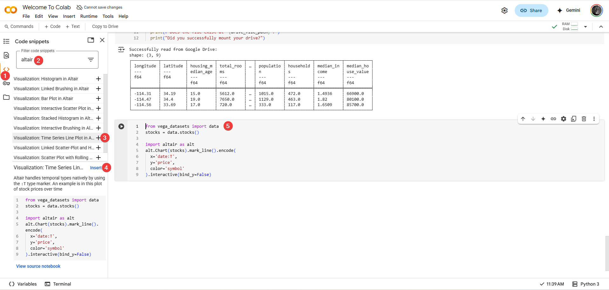
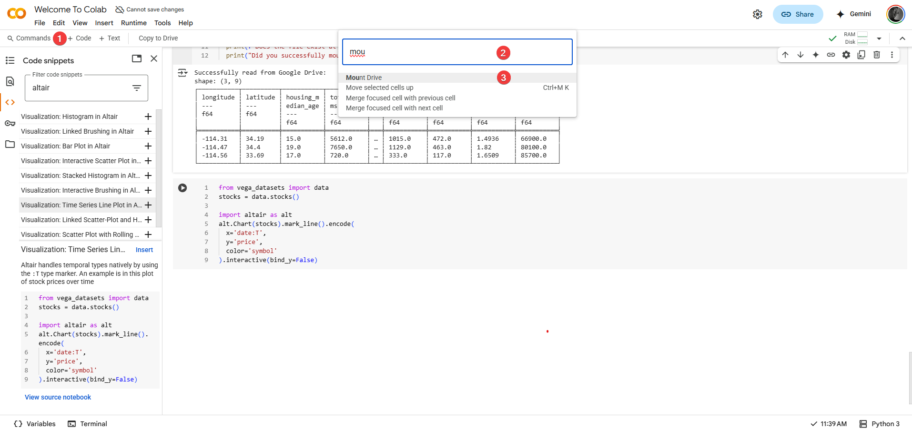

--- 
icon: material/numeric-6
---

# **Going Deeper (Optional Exploration)**

You've now covered all the essential Colab features needed to succeed in this course! This final section explores a few additional tools and concepts. These are **optional** – you don't strictly need them for your assignments – but learning them can make your workflow faster, more efficient, or help you understand the Colab environment more thoroughly.

## **Useful Keyboard Shortcuts**

While Colab's menus and toolbars are user-friendly, using keyboard shortcuts is often much faster once you learn a few key combinations. This can significantly speed up writing and manipulating your notebooks.

**Command Mode vs. Edit Mode:**
A key concept for shortcuts is understanding Colab's (and Jupyter's) modes:

* **Edit Mode:** You're actively typing inside a cell (usually indicated by a green border around the cell and a blinking cursor). Keystrokes insert text or code.
* **Command Mode:** You've selected a cell but aren't typing *inside* it (usually indicated by a blue border). Keystrokes act as commands on the cell itself (like deleting it, changing its type, etc.).
    * Press the ++"<prefix>"++ key combo, ++ctrl+m++ or ++esc++,to switch from Edit Mode to Command Mode.
    * Press **`Enter`** (or click inside a cell) to switch from Command Mode to Edit Mode.

**Some Highly Useful Shortcuts:**

*(Remember to be in the correct mode - usually Command Mode unless otherwise specified)*

* **Essential Execution:**
    * `Shift + Enter`: Run current cell, select cell below (works in both modes).
    * `Ctrl + Enter` (`Cmd + Enter` on Mac): Run selected cell(s), keep focus here (works in both modes).
    * `Alt + Enter` (`Option + Enter` on Mac): Run current cell, insert new code cell below (works in both modes).
* **Cell Manipulation (Command Mode):**
    * `A`: Insert new code cell **A**bove current cell.
    * `B`: Insert new code cell **B**elow current cell.
    * `D`, `D` (press `D` twice quickly): **D**elete selected cell(s) (use with care!).
    * `M`: Change cell type to **M**arkdown (Text).
    * `Y`: Change cell type back to code (**Y** not intuitive, just is).
    * `Z`: Undo last cell operation (like delete).
    * `Shift + M`: Merge selected cells (select multiple with `Shift + Up/Down Arrow` first).
* **Editing (Edit Mode):**
    * `Ctrl + /` (`Cmd + /` on Mac): Comment or uncomment the selected line(s) of code with `#`.

**Discover More:** This is just a small sample! To see the full list of available shortcuts and even customize them, go to the main menu: **`Tools` -> `Keyboard shortcuts`**. Learning just a few common ones can make a noticeable difference in your speed.

## **Code Snippets**

Colab includes a library of pre-written code snippets for common tasks, which can save you time and help you discover functionalities.

* **How to Access:** In the **Left Sidebar**, click the **Code Snippets icon** :material-numeric-1-circle:{ .annotation } (often looks like `< >`).
* **Browse & Insert:** A pane will open with searchable snippets, often categorized (e.g., "Visualization", "Importing data") :material-numeric-2-circle:{ .annotation }. Find a snippet you need (like "Mount Google Drive" or examples for plotting libraries) :material-numeric-3-circle:{ .annotation } and click the "Insert" button (or sometimes just click the snippet):material-numeric-4-circle:{ .annotation }. The necessary code cell(s) will be added to your notebook:material-numeric-5-circle:{ .annotation }.
    
* **Usefulness:** Great for boilerplate code (like Drive mounting), exploring examples (especially for visualizations), or finding code for interacting with specific Google services.

## **The Command Palette**

If you can't remember a keyboard shortcut or where a command is hidden in the menus, the Command Palette is a powerful search tool for actions.

* **How to Access:** Use the toolbar :material-numeric-1-circle:{ .annotation } or press **`Ctrl + Shift + P`** (or **`Cmd + Shift + P`** on Mac).
* **Search & Execute:** A search bar pops up. Start typing the name of the action you want :material-numeric-2-circle:{ .annotation } (e.g., "markdown", "restart", "clear all", "table of contents"). The list filters as you type. Select the desired command using arrow keys and `Enter`, or click it :material-numeric-3-circle:{ .annotation }.

    

* **Benefit:** Allows quick keyboard access to virtually any Colab command without needing to memorize everything.

## **Understanding Resource Limits**

While Colab's free tier is generous, it's not infinite. Knowing the limitations helps prevent unexpected interruptions.

* **Key Limits:**
    * **Session Timeouts:** Your connection to the Colab backend (the Kernel) isn't permanent. It will disconnect after a certain period of **inactivity** (often 30-90 minutes) or after reaching a maximum **total runtime** (which can be around 12 hours, but varies).
    * **RAM (Memory):** You get a significant amount of RAM (~12GB generally), but loading extremely large datasets or performing very complex calculations can exceed this, potentially crashing your session.
    * **Disk Space:** The temporary session storage (where direct uploads go) is also limited.
    * **GPU/TPU:** Access to specialized hardware (which we generally won't need for this course) is also restricted in time and availability.
* **Consequences of Limits/Timeouts:** When your session ends (due to timeout or crash), the **Kernel state is lost**. This means:
    * All variables and loaded data in memory disappear.
    * Any files uploaded to temporary session storage are deleted.
    * Custom installed packages (`!pip install`) are removed.
    * You will need to reconnect and re-run your initialization cells (imports, Drive mount, installs, data loading).
* **Working Within Limits:**
    * Use **Google Drive** for persistent storage of notebooks and data (Section 4.3).
    * Develop the habit of structuring your notebooks so initialization steps are easy to re-run.
    * Use `Restart and run all` (Section 3.4) periodically to ensure your workflow is robust.
* **Paid Options:** Google offers Colab Pro/Pro+ with extended runtimes and more resources, but these are **not necessary** for completing this course successfully.
