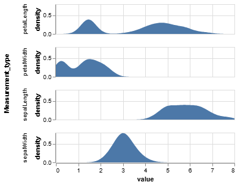
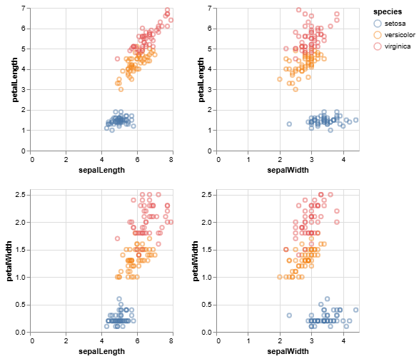
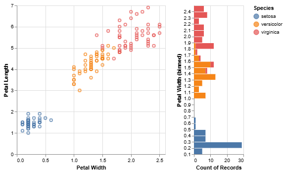
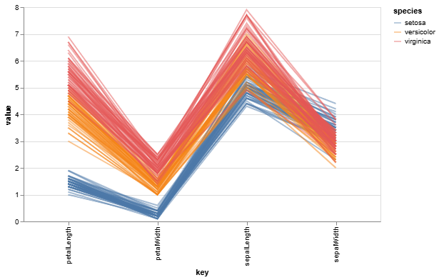

# Our First Modeling Algorithm

Given the diverse range of business problems, it follows that there is a diverse range of modeling algorithms available. A crucial step in any data science project is selecting the appropriate algorithm for the task at hand. A model designed for real-time fraud detection has fundamentally different operational requirements than one built for forecasting annual sales.

Think of machine learning algorithms as a collection of specialized tools in a data scientist's toolkit. While many tools can perform similar functions, some are better suited for specific jobs based on their power, precision, and ease of use. The choice of model often involves navigating a trade-off between several key factors.

## Key Factors in Model Selection

While dozens of algorithms exist, the selection process generally involves evaluating them against three primary criteria:

1.  **Performance:** This refers to the predictive accuracy of the model. For a given problem, which model yields the most accurate and reliable predictions? This is often the primary consideration, but it's rarely the only one.

2.  **Interpretability (or Explainability):** This is the extent to which the model's inner workings and decision-making process can be understood by humans. In many business contexts, especially regulated industries, a "black box" model that provides a prediction without a clear explanation is unacceptable. High interpretability is crucial for stakeholder buy-in, regulatory compliance, and model debugging.

3.  **Computational Cost:** This factor considers the resources required to train and deploy a model. This includes processing time, memory usage, and the associated financial cost. A highly complex model might be slightly more accurate but prohibitively expensive or too slow for a real-time application.

## Our First Algorithm: The Decision Tree

For our initial lessons, we will use an algorithm known as a **Decision Tree**. We are selecting this algorithm as our starting point for one primary reason: its exceptional **interpretability**.

A Decision Tree makes predictions by learning a hierarchical set of "if/then" rules, which can be visualized as a flowchart. This transparent structure allows us to see exactly how the model arrives at a conclusion, making it an excellent tool for learning the core concepts of modeling without the complexity of a "black box" algorithm.

***

The goal of this lesson is not to master dozens of algorithms, but to master the **end-to-end modeling workflow**. By learning this process with one transparent model, you will build a framework that can be applied to any algorithm you encounter in the future. We will now proceed to that workflow.

## Recap Learning Activity

???+ activity "**💡 Activity: Feature Analysis for Model Simplification**"

    **Objective:**

    To analyze a series of visualizations of the Iris dataset and, based on this analysis, make a data-driven recommendation on how to simplify a machine learning model for classifying iris species. This activity emphasizes the role of data visualization as an integral part of the modeling workflow for feature selection and building model intuition.

    **Introduction:**

    In machine learning, our goal is not always to build the most complex model possible. Often, a simpler, more efficient, and more interpretable model is preferable, provided it meets our performance requirements. One of the most effective ways to simplify a model is to reduce the number of input features, using only those with the most predictive power.

    Before we even train a model, we can use data visualization to gain insights into our features and make informed hypotheses about their usefulness. In this activity, you will act as a data scientist preparing to build a classification model for the Iris dataset. Your task is to analyze the provided charts to determine which features are most effective at discriminating between the three species (`setosa`, `versicolor`, and `virginica`) and which might be less useful or even redundant.

    ---

    **Part 1: Chart-by-Chart Analysis**

    Please examine each of the following visualizations and answer the guiding questions.

    **Chart 1: Univariate Density Plots **

    

    This set of charts shows the distribution of values for each of the four features independently.

    * **Guiding Questions:**
        * Look at the `petalLength` and `petalWidth` density plots. Do these distributions appear to be unimodal (one peak) or multimodal (multiple peaks)? What might the presence of multiple peaks suggest about the underlying data?
        * Now consider the `sepalLength` and `sepalWidth` plots. How do their shapes differ from the petal measurements? Do they appear to offer a clear separation of groups based on their distributions alone?

    **Chart 2: Pairwise Scatter Plots (``)**

    

    This "scatter plot matrix" shows the relationship between every pair of features, with points colored by species.

    * **Guiding Questions:**
        * Which single feature (looking at either an x-axis or y-axis) appears to provide the best separation for the `setosa` species (blue dots) from the other two species?
        * Examine the plot of `petalLength` vs. `petalWidth`. How separable do the three species look in this two-dimensional view?
        * Now look at `sepalLength` vs. `sepalWidth`. How well can you distinguish between the `versicolor` (orange) and `virginica` (pink) species in this view?

    **Chart 3: Scatter Plot with Histograms (``)**

    

    This chart provides a focused view of `petalLength` vs. `petalWidth` and includes histograms on the margins showing the distribution of each feature, binned and colored by species.

    * **Guiding Questions:**
        * The histogram on the right shows the distribution of `petalWidth`. Based on this histogram, could you define a simple rule (e.g., "if `petalWidth` is less than X...") to perfectly identify the `setosa` species?
        * How much overlap is there between `versicolor` and `virginica` along the `petalWidth` and `petalLength` dimensions?

    **Chart 4: Parallel Coordinates Plot (``)**

    

    This plot displays each individual flower as a line, connecting its measurements across all four features. Each line is colored by its species.

    * **Guiding Questions:**
        * Trace the lines for the `setosa` species (blue) with your eyes. Do they follow a distinct pattern compared to the other two species? Which two features show the most dramatic separation for the `setosa` group?
        * Now compare the `versicolor` (orange) and `virginica` (pink) lines. Where do their paths most overlap, and where do they show the most separation? Does this confirm what you observed in the other charts?

    ---

    **Part 2: Synthesis and Recommendation**

    Based on your comprehensive analysis of all four charts, please formulate a recommendation for a modeling team.

    * **Final Task:**
        1.  If you were asked to build a classification model with **only two features**, which two would you choose and why? Justify your answer by referencing specific insights from at least two of the provided charts.
        2.  Which single feature appears to be the **least useful** for discriminating between all three species? Explain your reasoning.
        3.  **Bonus Question:** How could a model trained on only your two chosen features potentially be simpler, faster, and more cost-effective in a real-world application (e.g., a mobile app that identifies flowers from measurements) compared to a model that uses all four features?