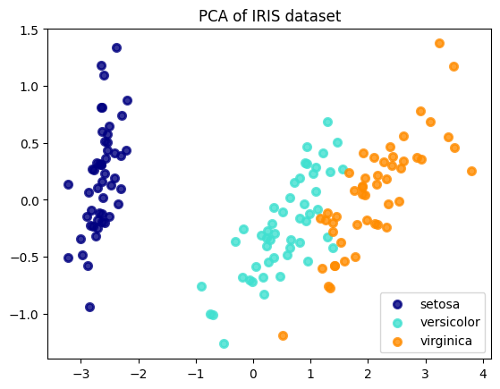

# Dimensionality Reduction

The second major type of unsupervised learning we will cover is **dimensionality reduction**. As its name suggests, this is the process of reducing the number of features (or dimensions) in a dataset while trying to preserve as much of the important information as possible.

#### **Motivation: Why Reduce Dimensions?**

You might wonder why we would intentionally discard features. There are several key motivations:

* **The "Curse of Dimensionality"**: As the number of features grows, the amount of data required to support a robust model grows exponentially. Too many features can make models perform worse on unseen data, a phenomenon known as the curse of dimensionality.
* **Visualization**: Humans can't visualize data beyond three dimensions. To plot and visually explore a dataset with many features, we must first reduce it to two or three dimensions.
* **Efficiency**: Fewer features mean that models require less memory and can be trained much faster, which is a critical consideration in production environments.

#### **Principal Component Analysis (PCA): The Intuition**

One of the most popular techniques for dimensionality reduction is **Principal Component Analysis (PCA)**. In essence, PCA works by finding new, artificial axes for the data. Instead of using the original features (like `petalLength` or `sepalWidth`), it creates a set of new, combined features called **principal components**.

These new components are designed to capture the maximum possible **variance** (or spread) in the data. The first principal component (PC1) is the single axis that captures the most variance. The second principal component (PC2) is the axis that captures the most *remaining* variance, and so on.

By using only the first few principal components (e.g., PC1 and PC2), we can often represent a significant portion of the original dataset's information in a much lower-dimensional space, making it easier to visualize and model.


### A Concrete Example for PCA and Latent Structure

Imagine a company that wants to understand customer satisfaction and conducts a detailed survey with 20 questions.

#### The Observed Features

The raw data consists of customer ratings (1-5) for questions like:

* *Q1: How would you rate our product's price?*
* *Q2: Do you feel our product offers good value?*
* *Q3: Was our customer support agent helpful?*
* *Q4: Was your support issue resolved quickly?*
* *Q5: Do you trust our brand?*
* *Q6: Would you recommend us to a friend?*
* ...and 14 other questions.

Building a model on all 20 features can be complex and inefficient, as many questions are related.

#### Discovering the Latent Structure with PCA

Instead of treating all 20 questions as independent, PCA can analyze the correlation patterns in the responses and discover the underlying, or **latent**, drivers of satisfaction.

It might find that the responses are primarily driven by three "meta-features":

1.  **Component 1 (Value Perception):** A new, single feature that captures the combined essence of the questions about price and value (Q1, Q2, ...).
2.  **Component 2 (Service Quality):** A second feature that summarizes the questions about the support experience (Q3, Q4, ...).
3.  **Component 3 (Brand Loyalty):** A third feature that represents the themes of trust and recommendation (Q5, Q6, ...).

#### The Business Value

Instead of working with 20 noisy and correlated features, the company can now use just these 3 powerful principal components. This allows them to build simpler, faster models and gain a clearer understanding of what truly drives customer satisfaction.


### **Code Walkthrough: Visualizing High-Dimensional Data with PCA**

The Iris dataset has four features, making it impossible to visualize in its entirety on a single 2D plot. This code example demonstrates how to use Principal Component Analysis (PCA) to reduce the data from four dimensions to two, allowing us to create a meaningful visualization that still captures the essence of the original data.

#### **1. Setup and Data Loading**

First, we import the necessary libraries. We need `matplotlib` for plotting, `PCA` from `sklearn.decomposition`, and the `load_iris` dataset itself.

```python
import matplotlib.pyplot as plt
from sklearn.decomposition import PCA
from sklearn.datasets import load_iris

# Load the Iris dataset
iris = load_iris()
X = iris.data
y = iris.target
target_names = iris.target_names
```

  * `X` now holds our data with 4 features (the four measurements).
  * `y` holds the corresponding species label (0, 1, or 2).

-----

#### **2. Applying PCA**

Next, we instantiate and fit the `PCA` model. The most important hyperparameter here is **`n_components=2`**, where we explicitly tell PCA that we want to reduce the data to just two principal components. The `.fit(X)` command learns the optimal 2D projection from our 4D data, and `.transform(X)` then applies this projection to create our new, low-dimensional dataset `X_r`.

```python
# Instantiate and fit the PCA model
pca = PCA(n_components=2)
X_r = pca.fit_transform(X)
```

After this step, `X_r` is a new array with the same number of rows as the original data, but now with only two columns representing PC1 and PC2.

-----

#### **3. Analyzing the Explained Variance**

This is a crucial step to understand how much information our new components have retained. The `explained_variance_ratio_` attribute tells us the percentage of the original data's variance that is captured by each principal component.

```python
# Print the explained variance ratio
print(
    "explained variance ratio (first two components): %s"
    % str(pca.explained_variance_ratio_)
)
```

The output will show that the first principal component (PC1) alone captures the vast majority of the variance (typically \>90%), and together, the first two components capture a very high percentage of the original information. This gives us confidence that our 2D plot will be a meaningful representation of the data.

-----

#### **4. Creating the Visualization**

Finally, we create a scatter plot of our new 2D data (`X_r`). We loop through each class (`setosa`, `versicolor`, `virginica`), plotting the points for each with a different color and label.

```python
# Set up the plot
plt.figure()
colors = ["navy", "turquoise", "darkorange"]
lw = 2

# Plot each class separately
for color, i, target_name in zip(colors, [0, 1, 2], target_names):
    plt.scatter(
        X_r[y == i, 0], X_r[y == i, 1], color=color, alpha=0.8, lw=lw, label=target_name
    )

# Add title and legend
plt.legend(loc="best", shadow=False, scatterpoints=1)
plt.title("PCA of IRIS dataset")
plt.show()
```
<figure markdown="span">
    { width="600" }
  <figcaption>Applying Principle Components Analysis to Iris Dataset</figcaption>
</figure>

#### **5. Interpreting the Result**

The final plot shows a 2D "shadow" of the original 4D data. You can clearly see that the three species form distinct clusters. The `setosa` class is perfectly separated, while the `versicolor` and `virginica` classes are mostly separated, with some minor overlap. This visualization confirms that even after reducing the dimensionality by half, the fundamental structure required to distinguish between the species is preserved. This is the power of PCA in action.
